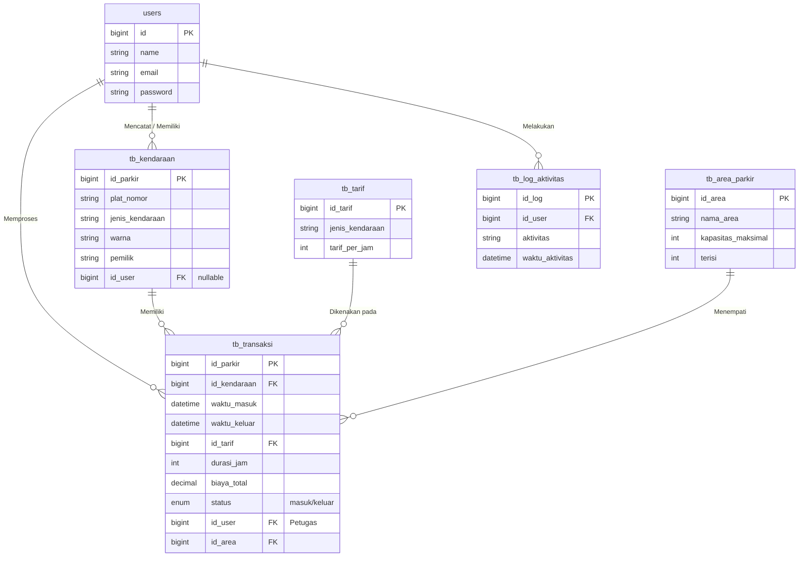

# Entity Relationship Diagram (ERD) - Parkir 2077

Dokumen ini memuat diagram relasi entitas untuk basis data aplikasi Parkir 2077.

## Deskripsi Tabel & Relasi

1. **`users`**
   Merupakan tabel inti untuk mencatat pengguna (Admin, Petugas, Owner). Diatur aksesnya menggunakan Spatie Permission (Role-Based Access Control).

2. **`tb_kendaraan`**
   Menyimpan profil kendaraan yang masuk/terdaftar. Berelasi dengan `users` (siapa yang mendaftarkan/memiliki akun, bersifat opsional).

3. **`tb_tarif`**
   Master data klasifikasi harga parkir berdasarkan jenis kendaraan (Motor, Mobil, dll) dan perhitungannya dihitung per-jam.

4. **`tb_area_parkir`**
   Tabel kapasitas ruang dan gedung. Kolom `terisi` nilainya di-update secara dinamis oleh Transaksi.

5. **`tb_transaksi`**
   Tabel pusat. Menghubungkan semua data (`tb_kendaraan`, `tb_tarif`, `tb_area_parkir`, `users`). Menampung hitungan akhir operasional.

6. **`tb_log_aktivitas`**
   Digunakan untuk keperluan *tracing* audit. Merekam siapa (*trigger* dari user ID) yang melakukan manipulasi data (*aktivitas*) dan kapan waktunya.
