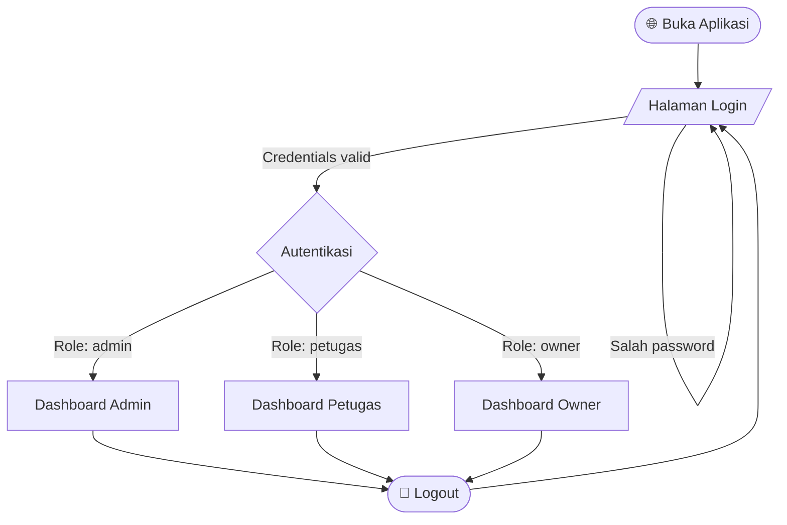
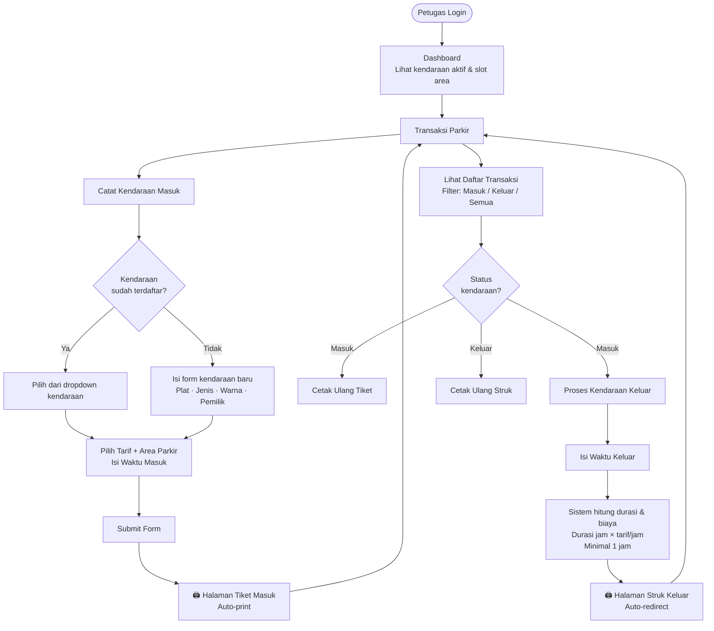
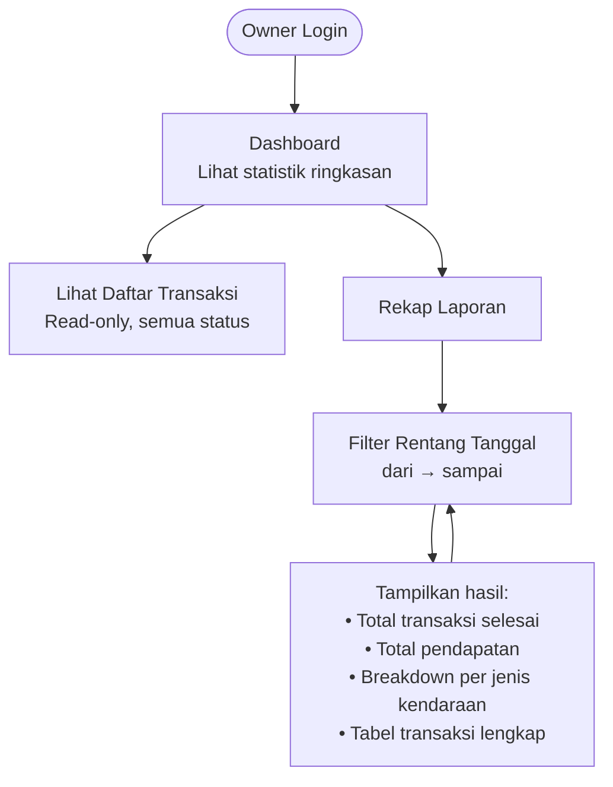

# User Flowchart — Parkir 2077

Diagram alur pengguna berdasarkan 3 role yang ada di sistem.

---

## Alur Umum (Semua Role)

---

## 🔴 Admin

> Akses penuh ke seluruh master data dan konfigurasi sistem.

```mermaid
flowchart TD
    A([Admin Login]) --> DASH[Dashboard\nLihat statistik & ringkasan]

    DASH --> UM[Manajemen User]
    UM --> UM1[Lihat daftar user]
    UM --> UM2[Tambah user baru]
    UM --> UM3[Edit user & reset password]
    UM --> UM4[Hapus user]
    UM2 & UM3 --> UM_ROLE[Assign Role ke User]

    DASH --> RM[Manajemen Role]
    RM --> RM1[Lihat daftar role & permission]
    RM --> RM2[Buat role baru]
    RM --> RM3[Edit permission role]
    RM --> RM4[Hapus role]

    DASH --> TM[Tarif Parkir]
    TM --> TM1[Lihat daftar tarif]
    TM --> TM2[Tambah tarif baru\nMotor / Mobil / Lainnya]
    TM --> TM3[Edit tarif per jam]
    TM --> TM4[Hapus tarif]

    DASH --> AM[Area Parkir]
    AM --> AM1[Lihat daftar area & kapasitas]
    AM --> AM2[Tambah area baru]
    AM --> AM3[Edit nama & kapasitas]
    AM --> AM4[Hapus area]

    DASH --> KM[Data Kendaraan]
    KM --> KM1[Lihat semua kendaraan terdaftar]
    KM --> KM2[Tambah kendaraan]
    KM --> KM3[Edit data kendaraan]
    KM --> KM4[Hapus kendaraan]

    DASH --> LOG[Log Aktivitas]
    LOG --> LOG1[Lihat riwayat semua aktivitas\nmasuk/keluar kendaraan + timestamp + petugas]

    DASH --> TRX[Transaksi Parkir]
    TRX --> TRX_P[Alur sama seperti Petugas ↓]

    DASH --> LAP[Rekap Laporan]
    LAP --> LAP_O[Alur sama seperti Owner ↓]
```

---

## 🟡 Petugas

> Fokus pada operasional harian: catat kendaraan masuk & keluar, cetak tiket/struk.

---

## 🟢 Owner

> Akses read-only ke laporan keuangan dan rekap transaksi.

---

## Ringkasan Akses per Role

| Fitur | Admin | Petugas | Owner |
|---|:---:|:---:|:---:|
| Dashboard | ✅ | ✅ | ✅ |
| Manajemen User | ✅ | ❌ | ❌ |
| Manajemen Role | ✅ | ❌ | ❌ |
| Tarif Parkir (CRUD) | ✅ | 👁️ read | ❌ |
| Area Parkir (CRUD) | ✅ | 👁️ read | ❌ |
| Data Kendaraan (CRUD) | ✅ | ✅ create+read | ❌ |
| Log Aktivitas | ✅ | ❌ | ❌ |
| Catat Kendaraan Masuk | ✅ | ✅ | ❌ |
| Proses Kendaraan Keluar | ✅ | ✅ | ❌ |
| Cetak Tiket Masuk | ✅ | ✅ | ❌ |
| Cetak Struk Keluar | ✅ | ✅ | ❌ |
| Rekap Laporan | ✅ | ❌ | ✅ |
| Lihat Transaksi (read) | ✅ | ✅ | ✅ |
